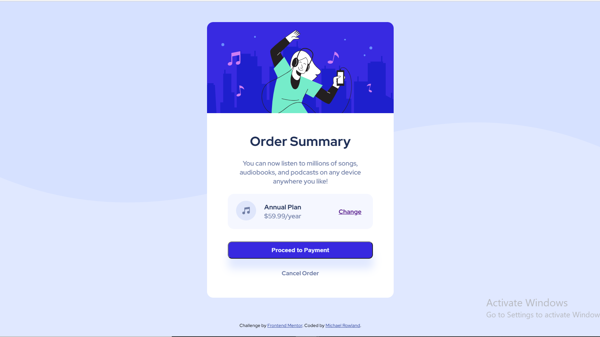

# Frontend Mentor - Order summary card solution

This is a solution to the [Order summary card challenge on Frontend Mentor](https://www.frontendmentor.io/challenges/order-summary-component-QlPmajDUj). Frontend Mentor challenges help you improve your coding skills by building realistic projects. 

## Table of contents

- [Overview](#overview)
  - [The challenge](#the-challenge)
  - [Screenshot](#screenshot)
  - [Links](#links)
- [My process](#my-process)
  - [Built with](#built-with)
  - [What I learned](#what-i-learned)
  - [Continued development](#continued-development)
  - [Useful resources](#useful-resources)
- [Author](#author)
- [Acknowledgments](#acknowledgments)

## Overview

### The challenge

Users should be able to:

- See hover states for interactive elements. This can be observed by placing the cursor over the payment button and cancel order

### Screenshot

### Links

- Live Site URL: [Order summary challenge](https://mykie88.github.io/order-summary-component-main/)

## My process

### Built with

- Semantic HTML5 markup
- CSS custom properties
- Flexbox
- CSS Grid
- Mobile-first workflow

### What I learned

HTML tags and CSS font, typography and flexbox

### Useful resources

- [Example resource 1](https://www.w3schools.com/) - This helped me understand CSS.
- [Example resource 2](https://developer.mozilla.org/) - Helped me understand html tags.

## Author

- Website - [Michael Rowland](https://www.your-site.com)
- Frontend Mentor - [@mykie88](https://www.frontendmentor.io/profile/yourusername)
- Twitter - [@inc_mykie](https://www.twitter.com/inc_mykie)

## Acknowledgments

Shout out to my team for their support; @O4codes, @manofmind, @pauline, @fae, @kingsley
